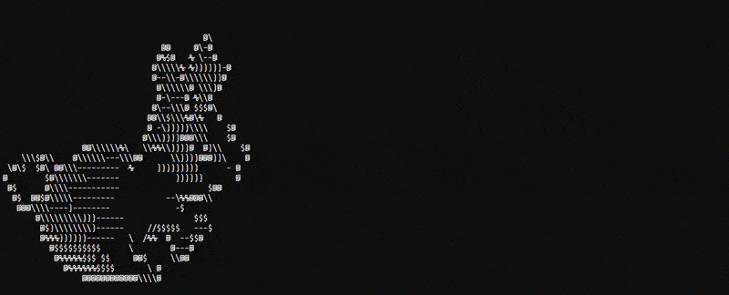

```plaintext
           ____               __     __ __       __ _____
   ____   / __ \       _____ / /_   / // /  ____/ /|__  /
  / __ \ / / / /      / ___// __ \ / // /_ / __  /  /_ < 
 / / / // /_/ /      (__  )/ / / //__  __// /_/ / ___/ / 
/_/ /_/ \____/______/____//_/ /_/   /_/   \__,_/ /____/  
             /_____/                                      
```

<picture></picture>
⨳ **c • rust • go • python**  
⨳ **writing code that will outlive me**  
⨳ **trust is a vulnerability** 
<br>
⨳ **building tools**  
⨳ **security is an illusion**  

⨳ **this world is rotting, i’m here to watch it burn**  
<br>
<br>
<center> 
<h2>you are being watched</h2>
</center>
<picture></picture>
<br>
certified shizo computer yapper
